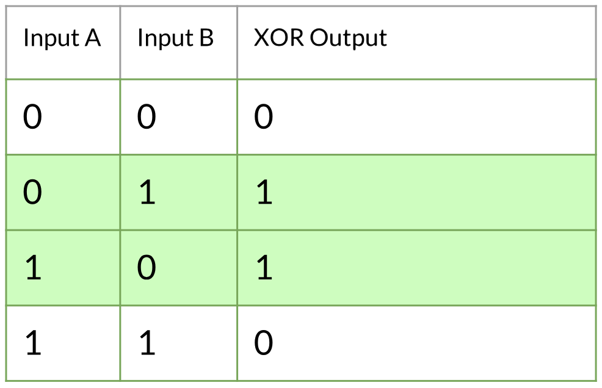

<h1 style="text-align:center;">One-Time Pad🔐</h1>

 

## Sobre o Projeto

 Este é um projeto acadêmico, realizado pelos estudantes [Guilherme Cella](https://github.com/guiCella), [Renan de Jesus](https://github.com/Renan-de-jesus) e [Victor Barbosa](https://github.com/victorbsad). Ele tem como obejtivo utilizar a criptografia para manter seus dados seguros.

## Objetivo

O objetivo deste projeto é criar um aplicativo web que possa receber arquivos e criptografá-los para garantir sua segurança durante o armazenamento ou transmissão. Além disso, o aplicativo também é capaz de descriptografar esses arquivos para que possam ser acessados novamente pelo usuário.

## Como Funcina

Esse projeto se baseia na criptografia One-Time Pad. A qual, para que funcione de maneira precisa e efetiva, necessita de uma chave de criptografia. Para ser mais especifico, esta chave consiste em uma determinda ordem de caracters, escolhida pelo usuário.

Com base nessa chave, usamos o operador lógico XOR, para encriptar ou decriptar os dados do arquivo enviado. Esse operador tem a capacidade de trocar os bits que compõem os caracteres, conforme mostra o exemplo abaixo.

## Instalação

Como esse projeto é um aplicativo web, não será necessario fazer nenhuma instalação. Porém, como o projeto ainda está em uma fase inicial, ele funciona apenas em localhost.

Para que o aplicativo rode em localhost você precisa ter instalado em sua máquina os seguintes programas:

- Git
- PHP
- Laravel
- Docker
- Ubuntu
- Composer
- Sail

Caso você não tenha algum, ou nenhum, desses aplicativos instalados, basta você clicar [neste link](Items/passo-a-passo.md) e seguir o passo a passo de como instalá-los.

## Como Utilizar 

- Para utilizar o aplicativo de maneira efetiva, precisamos de uma chave de criptografia, que nesse caso será uma senha criada pelo usuário. 
- Após o usuário inserir a chave desjada, ele deve inserir um documento que contenha os dados que ele quer criptografar.

